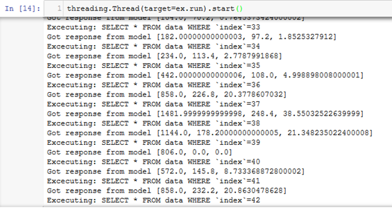

### ModelConductor Open Source IoT Co-Simulation Framework
_A high-abstraction library for your Digital Twin experiments and rapid prototyping_

This is an experimental project. Nothing is guaranteed - everything and anything could be broken at any time. 
For the time being, the running of FMU models, as well as Sklearn machine learning models are supported

For more examples and discussion, see the examples or the original publication [1]

[1] Aho, P. 2019. An Open Source Digital Twin Framework. Master's Thesis. Tampere University

#####Installation with pip:

0. Make sure `python >= 3.7.4` and `pip` are installed
1. CD to where `setup.py` is located
2. Run `pip install . `

Altenatively, to install ModelConductor and all the dependencies in one go:

`pip install –r requirements.txt`

#####Example use case for simple one-to-one simulation

1 Setup a mock-up data source which emulates measurement data being periodically written to a database

```
# Simulate incoming measurement data 
# to use with ModelConductor
import sqlalchemy as sqla
import pandas as pd
from datetime import datetime as dt
from time import sleep

data = pd.read_csv("CoupledClutches_in_sh.csv")

def simulate_writes(delay=0.01):
    """Simulate a db write between every delay seconds"""
    engine = sqla.create_engine('sqlite:///test.db')
    conn = engine.connect()

    def write_row(row):
        row.to_sql('data', con=conn, if_exists='append')

    for _, row in data.iterrows():
        if dt.now() >= ex.stop_time:
            conn.close()
            break
        write_row(pd.DataFrame(row).transpose())
        sleep(delay)

```
2 Setup the receive loop
```
from modelconductor.measurementhandler import IncomingMeasurementPoller
source = IncomingMeasurementPoller(polling_interval=0.05, 
                                    db_uri='test.db')
```
3 Setup the model loop:
```
from modelconductor.modelhandler import FMUModelHandler

target_keys = ["outputs[1]",
               "outputs[2]",
               "outputs[3]",
               "outputs[4]"]
input_keys = ["inputs"]
control_keys = ["time"]
timestamp_key = "time"

model=FMUModelHandler(
    fmu_path='CoupledClutches.fmu',
    start_time=0,
    stop_time=1.5,
    step_size=0.01,
    target_keys=target_keys,
    input_keys=input_keys,
    control_keys=control_keys,
    timestamp_key=timestamp_key)
```
4 Setup the One-to-One experiment
```
from modelconductor.experiment import OnlineOneToOneExperiment
ex = OnlineOneToOneExperiment(logging=True, runtime=3, log_path='out.csv')
ex.add_route((source, model))
ex.setup()
```
5 Run
```
# Start the data source
import threading
threading.Thread(target=simulate_writes).start()
# Start the experiment
threading.Thread(target=ex.run).start()
```


