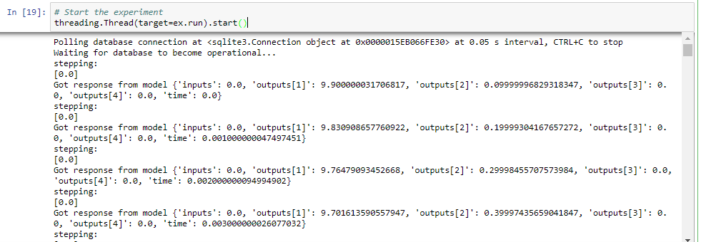

### ModelConductor Open Source IoT Co-Simulation Framework
_A high-abstraction library for conducting your Digital Twin experiments and rapid prototyping_

This is an experimental project. Nothing is guaranteed and everything could be broken at any time. For the time being, 
we support the running of FMU models, as well as Sklearn and Keras.

#####Installation with pip:

0. Make sure `pip` is installed (duh)
1. CD to where `setup.py` is located
2. run `pip install . `

#####Example use case for simple one-to-one simulation

1. Setup a mock-up data source which emulates measurement data being periodically written to a database

```
# Simulate incoming measurement data 
# to use with ModelConductor

import sqlalchemy as sqla
import pandas as pd
from datetime import datetime as dt
from time import sleep

# read in the raw data
data = pd.read_csv("noisy_nrtc.csv")

def simulate_writes(delay=1):
    """Simulate a db write between every delay sec-onds"""
    engine = sqla.create_engine('sqlite:///test.db')
    conn = engine.connect()

    def write_row(row):
        row.to_sql('data', con=conn, if_exists='append')

    for _, row in data.iterrows():
        if dt.now() >= ex.stop_time:
            conn.close()
            break
        write_row(pd.DataFrame(row).transpose())
        sleep(delay)


```
2. Setup and run the experiment
```
# import the necessary components from modelhandler
# package

from modelconductor.modelhandler import FMUModelHandler
from modelconductor.measurementhandler import IncomingMeasurementPoller
from modelconductor.experiment import OnlineOneToOneExperiment

# additional imports
import threading

# Setup the datasource, the model and the 
# one-to-one experiment

source = IncomingMeasurementPoller(polling_interval=1, 
                                    db_uri='test.db')
target_keys = ["Power"]
input_keys = ["Speed", "Torque"]

model=FMUModelHandler(
				fmu_filename='compute_power_5_2.fmu',
                    start_time=0,
                    threshold=2,
                    stop_time=1238,
                    step_size=1,
                    target_keys=target_keys,
                    input_keys=input_keys)

ex = OnlineOneToOneExperiment(logging=True, runtime=30)

# online one-to-one experiment from single source
# to single model

ex.add_route((source, model))
ex.setup()

# Start the simulated measurement
threading.Thread(target=simulate_writes).start()
# Start the experiment
Threading.Thread(target=ex.run).start()
```
3. Expected output:


